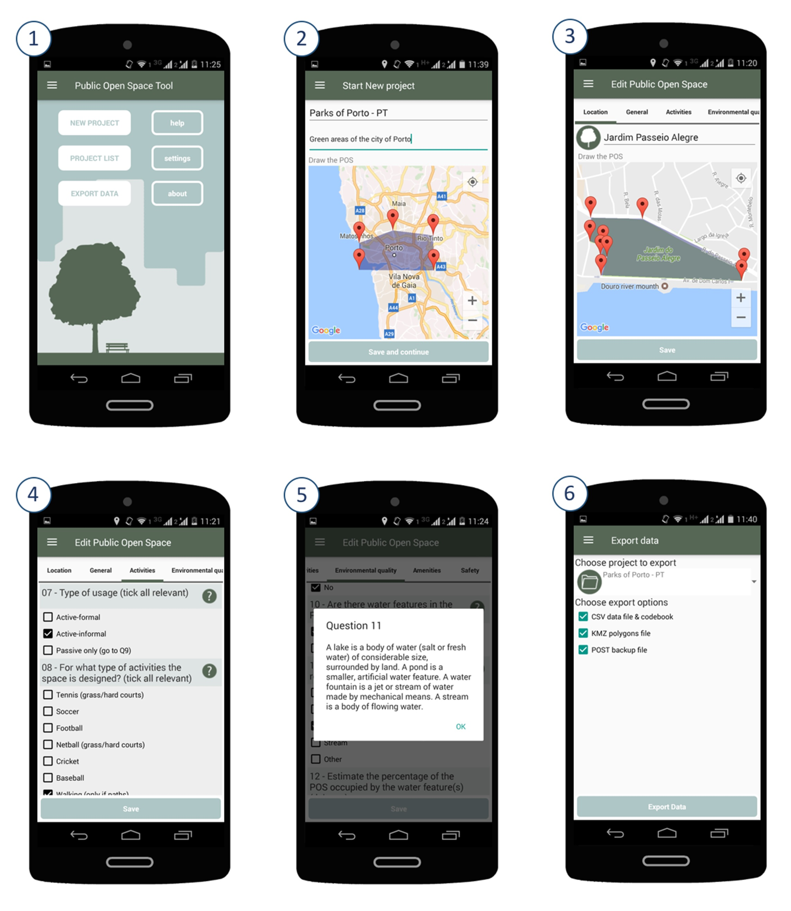

## POST for Android - An app for measuring the quality of open green spaces
The POST (Quality of Public Open Space Tool)[1] is a well-established and validated tool designed for auditing public open spaces such as parks and other greenspaces, with particular emphasis on the physical attributes that may either encourage or discourage their use for physical activity. The POST relies on direct observation and it is composed of 49 items covering four key domains: activities, environmental quality, comfort, and safety.

This App was developed by Instituto de Saúde Publica da Universidade do Porto (ISPUP) and by the Centre for the Built Environment and Health of the University of Western Australia based on the original paper version of POST. 

Besides the user-friendly interface, this electronic version now includes other functionalities, namely storing data, mapping features, and exporting the database with the audit results.	

### How it works
The app stays true to the original POST paper instrument but adds several functionalities to facilitate the POS audits and the subsequent data analysis. Figure 1 shows the home screen (1) and the main functionalities of the app (2 to 6).

*Figure 1. App screens and functionalities: (1) Home Screen; (2) New Project - entering the name, description and defining the project geographic extent; (3) Edit Public Open Space – mapping the POS; (4) Edit Public Open Space – answering to the POST items; (5) Hints containing relevant information and definitions; (6) Export data *

Briefly, to perform the audit, one should use the following instructions:
* 1.	Create a new project: on the ‘Home Screen’ click on ‘New Project’ and ‘Type the project name’, ‘Type the project description’, ‘Set the geographic extent of the project’ and ‘Save and continue’. The geographic extent can be defined by drawing a polygon delimitating the area that will be audited, such as a city. Mark the vertices of the polygon by pressing the screen for a few seconds, vertex by vertex, until you close the polygon that delimits the area.
* 2.	Add new POS: After saving the project, the option ‘Add new POS’ will appear. After clicking on it, a new window called ‘Edit POS’ will open. On the ‘Location’ tab ‘Type the POS name’ and "’Draw the POS’ by drawing a polygon delimiting the POS. Mark the vertices of the polygon by pressing the screen for a few seconds, vertex by vertex, until you close the polygon corresponding to the POS. This polygon can then be exported into a KMZ format.
* 3.	Answer to the POST items: On the ‘General’ tab, answer all items (reference number, address, postal code, year of establishment). Note that the size of the area and the geocode (geographic coordinates) are automatically calculated as long as you previously drew the polygon corresponding to the POS. Slide the top bar to answer the items of other domains: activities (items 07 and 08); environmental quality (items 09 to 25); amenities (items 26 to 42) and safety (items 43 to 49). Notice that, next to some questions, there is a question mark with a hint, containing relevant information and definitions. The audit can be saved at any time by clicking ‘Save’. After answering to the items regarding a certain POS you can repeat the process for all the POS of your project.
* 4.	Export the data: To export your spatial and attribute data, click on ‘Export data’. Choose the project and the elements you wish to export (‘CSV data file & codebook’; ‘KMZ polygons file’; ‘POST backup file’) and enter the destination email.

### References
[1] Broomhall MH, Giles-corti B, Lange A. Quality of Public Open Space Tool (POST). Perth, Western Australia: School of Population Health, The University of Western Australia; 2004. http://www.see.uwa.edu.au/research/cbeh/projects/post.